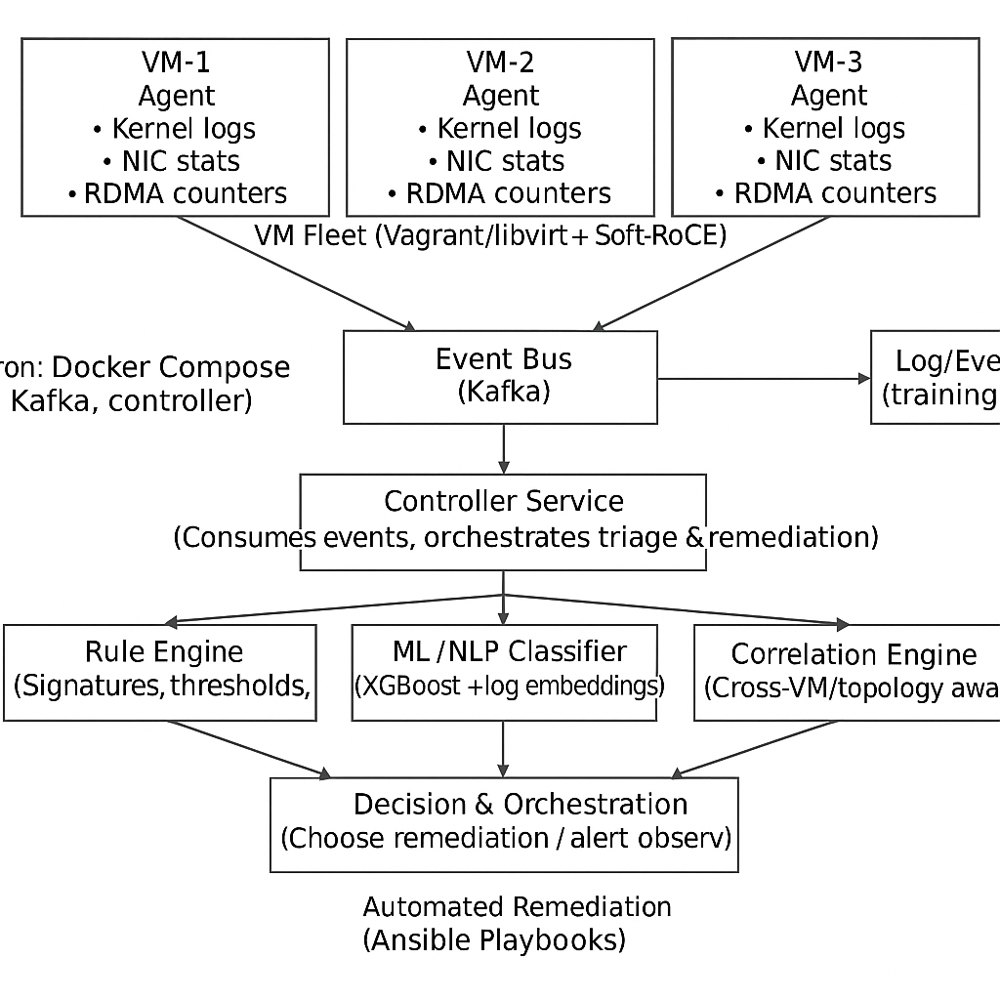

# Network Bug Triage & Remediation Platform

## 📌 Overview
This platform automates **detection, correlation, and remediation** of network issues across a multi-VM environment.  
It integrates **network telemetry (kernel logs, NIC stats, RDMA counters)** with **AI/ML (XGBoost, NLP log parsing)** to:
- Detect kernel, driver, and RDMA errors
- Correlate across a multi-VM topology
- Apply safe remediation (MTU fixes, driver restarts, config rollbacks) via **Ansible**

## 🏗️ Architecture
- **Agent (per VM)**: Collects telemetry → pushes JSON events to Kafka  
- **Controller**: Consumes events → applies rule-based + ML triage → triggers remediation playbooks  
- **Infra**: Multi-VM setup with Vagrant/libvirt + Soft-RoCE for RDMA  
- **ML/NLP**: XGBoost classifier + transformer-based log embeddings

<<<<<<< HEAD

## Ansible deploy
See `docs/ansible.md` for running controller/agent roles with `ansible-playbook infra/site.yml`.
=======
## 🏗️ System Architecture

>>>>>>> 2c33c6dd7b87911d1864b9294e93318319aa3aef
