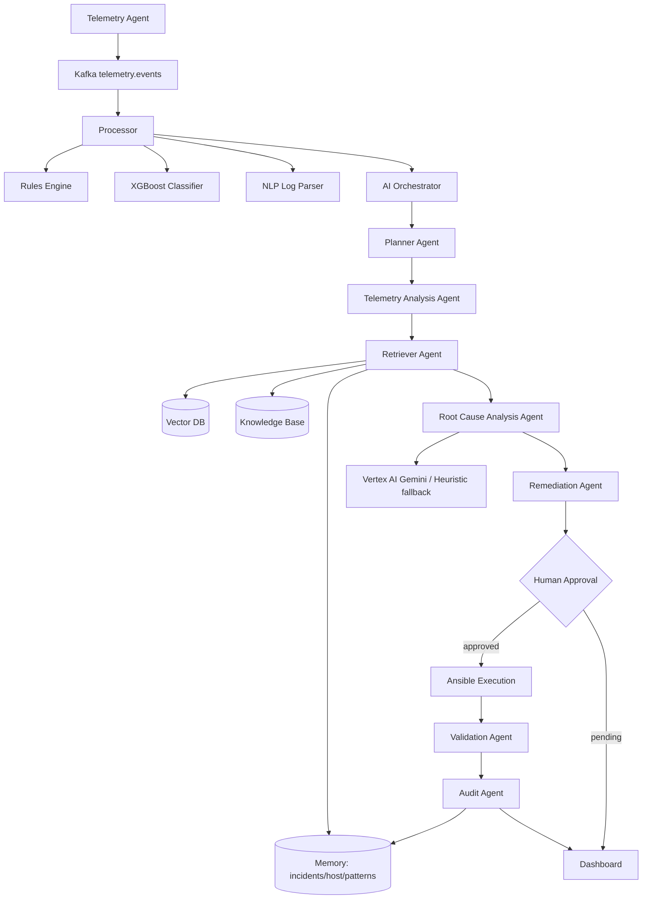

# AI Multi-Agent Architecture

This document describes the AI reasoning layer added on top of the existing
deterministic triage/remediation stack. The legacy pipeline (rules engine,
XGBoost classifier, NLP embeddings, Ansible remediation, Kafka transport,
dashboard) is **unchanged**; the AI layer augments it.

## Design goals

1. **Never break existing functionality.** The AI layer is optional and imported
   lazily. If it fails to initialise, the legacy path continues untouched.
2. **Graceful degradation.** Every optional dependency (Vertex AI, LangChain,
   LangGraph, ADK, Chroma, Prometheus) is imported defensively. With none of
   them installed, the platform runs a deterministic offline reasoner and a
   numpy cosine-similarity retriever.
3. **Reuse, don't replace.** XGBoost stays the fast first-pass classifier and the
   existing sentence-transformer embeddings are reused for retrieval. The LLM
   only performs the deeper reasoning steps.

## Data flow



## Module map (`controller/ai/`)

| Module | Purpose |
|--------|---------|
| `config.py` | AI configuration (file + env), Vertex/retrieval/memory settings |
| `prompts.py` | Versioned prompt library (RCA, remediation, validation) |
| `llm.py` | LLM facade: Vertex Gemini backend + deterministic heuristic backend |
| `vector_store.py` | Pluggable vector store (Chroma → numpy cosine fallback) |
| `knowledge_base.py` | Loads runbooks / RDMA / kernel docs into chunks |
| `retriever.py` | Hybrid retrieval (vector + keyword + incident history) |
| `memory.py` | Conversation/incident/host/remediation/pattern memory |
| `agents.py` | The eight agents operating over a shared `WorkflowState` |
| `orchestrator.py` | ADK/LangGraph-style graph executor + human-approval gate |
| `evaluation.py` | Reproducible accuracy harness |
| `monitoring.py` | Counters + latency (Prometheus optional) |

## Human-approval gate

When `require_human_approval` is set (default), the Remediation Agent emits a
plan with `status = pending_approval` and the orchestrator **pauses before
execution**. The Flask endpoint `POST /api/ai/approve` resumes the workflow
(validation + audit) once a human approves. Kernel panics and unknown domains
are never auto-remediated regardless of confidence.

## Enabling Vertex AI Gemini

```bash
export GOOGLE_CLOUD_PROJECT=my-project
export GOOGLE_APPLICATION_CREDENTIALS=/path/to/sa.json
export NBT_VERTEX_MODEL=gemini-1.5-pro
pip install google-cloud-aiplatform
```

With these set, `GET /api/ai/status` reports `"llm_backend": "vertex-gemini"`
and all reasoning is performed through Vertex AI. Without them it reports
`"heuristic"` and the platform remains fully functional offline.
